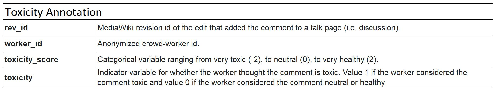

# University of Washington | DATA 512 - Human Centered Data Science

## Assignment 2: Bias in Data

-------------------------------------------------------------------------------

Have you ever wonder what is the distribution of toxicity score be?
  

How about the distribution of aggression score?

In this project, we will analyze and will have a better understanding about these two areas.

## Summary
The objective of this assignment is to examine the potential sources of bias in a corpus of human-annotated data (Wikipedia Talk Corpus) and describe some implications of those biases in connecting to [Perspective API](https://github.com/conversationai/perspectiveapi/wiki/perspective-hacks)

## Data Source
The data we use in this assignment is "Wikipedia Talk Labels" which you can download from this [Figshare](https://figshare.com/projects/Wikipedia_Talk/16731)

There are three separate datasets. You can download these datasets from the Figshare website and store on your project working directory.

1. Toxicity
- 160k labeled comments from English Wikipedia by approximately 10 annotators via Crowdflower on a spectrum of how toxic the comment is (perceived as likely to make people want to leave the discussion) to how healthy to conversation the contribution is.

2. Aggression
- 100k labeled comments from English Wikipedia by approximately 10 annotators via Crowdflower on how aggressive the comment was perceived to be. We also include some demographic data for each crowd-worker.

3. Personal Attacks
- 100k labeled comments from English Wikipedia by approximately of 10 annotators via Crowdflower on whether it contains a personal attack. We also include some demographic data for each crowd-worker.

## Data Description
* An overview of the data is available [here](https://meta.wikimedia.org/wiki/Research:Detox/Data_Release)
* These datasets are released under a CC0 public domain dedication.
* Citation: Wulczyn, Ellery; Thain, Nithum; Dixon, Lucas (2016): Wikipedia Detox. figshare. doi.org/10.6084/m9.figshare.4054689

Each individual dataset contains three separate TSV files: annotations, annotated comments, and worker demographics. Each dataset contains thousands of online discussion posts made by Wikipedia editors. Crowdworkers labelled these posts for three kinds of histile speech: toxicity, aggression, and personal attacks

## Motivation for the analysis
Social bias online has been gaining steam in the last five years. The more interaction users perform online, the larger data it produces with comments include toxicity and aggression. Therefore, i am interested in knowing more about the bias in these two areas: toxicity and aggression.

There are two hypothesis/questions that i want to find out:

1. Is there a bias relationships between worker demographics and labeling behavior in toxicity?
2. Is there a bias relationships between worker demographics and labeling behavior in aggression?

## Code structure
All of the analysis and the detail step by step are in one Jupyter notebook file which you can find from this GitHub repository
The images of visualization charts are also available in this repository.

